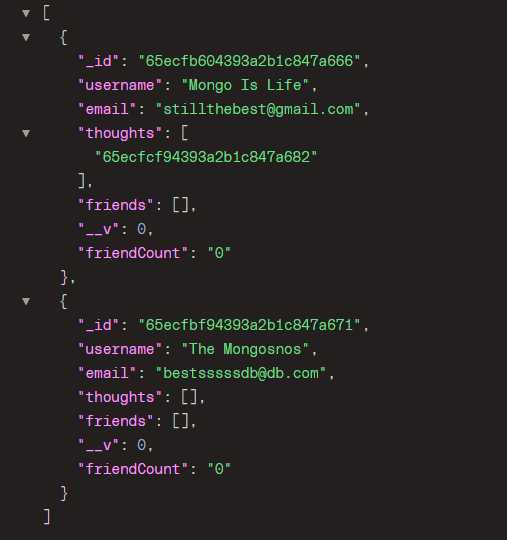

# The-Mongo

## Description
- A NoSQL social network api solution powered MongoDB!

## Technology Used
- Express Framework, Mongoose and Nodemon

## Screenshots

## Guides

- Video Guide Part One - [The Mongo Video Guide Part 1](https://www.awesomescreenshot.com/video/25670507?key=263c0f674aba8dbd2c2da7abec2f8491)

- Video Guide Part Two - [The Mongo Video Guide Part 2](https://www.awesomescreenshot.com/video/25670707?key=2aa759500447159bf2e3536402d9e825)  

## Links

 -Check out the project from my GitHub page! -
[GitHub URL](https://github.com/DaymenPasick/The-Mongo)

## License
None

